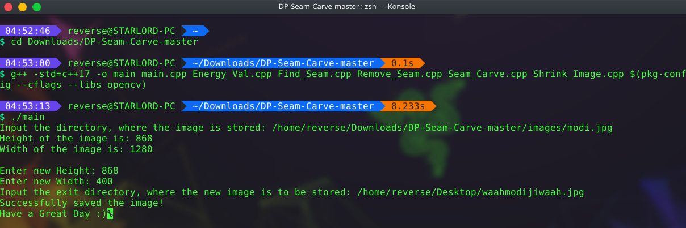
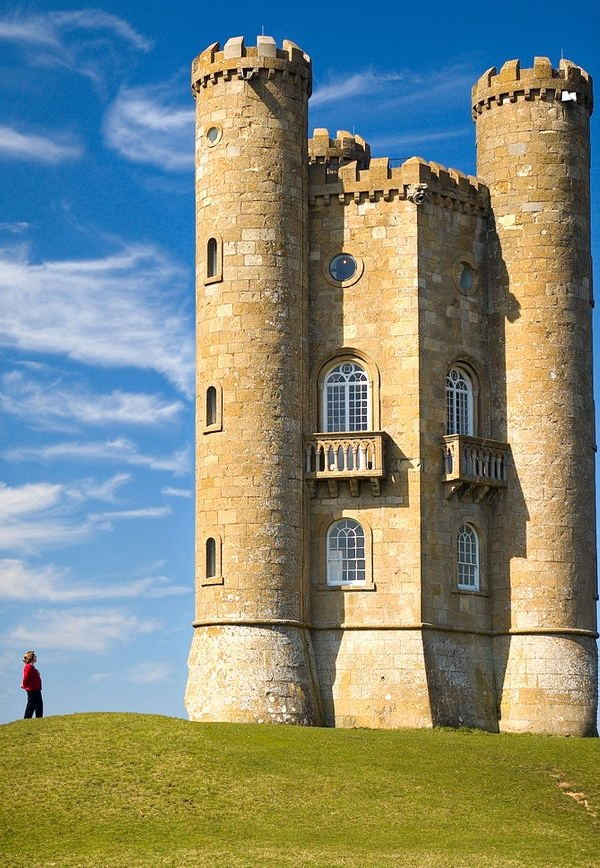
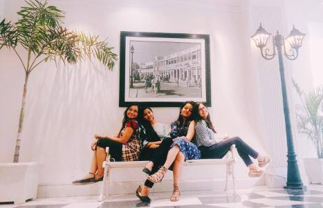

# DP-Seam-Carve
### Seam Carving (Content Aware Image Resizing)
Seam carving (or liquid rescaling) is an algorithm for content-aware image resizing, developed by Shai Avidan, of Mitsubishi Electric Research Laboratories (MERL), and Ariel Shamir, of the Interdisciplinary Center and MERL. It functions by establishing a number of seams (paths of least importance) in an image and automatically removes seams to reduce image size or inserts seams to extend it. Seam carving also allows manually defining areas in which pixels may not be modified, and features the ability to remove whole objects from photographs.

# Compiling and Executing the Program

1. In order to run the file, make sure your system is installed with the latest version of openCV.
   You can install it by visiting this official documentation page
      https://docs.opencv.org/2.4/doc/tutorials/introduction/table_of_content_introduction/table_of_content_introduction.html
  
2. Once you've setup OpenCV in your system, download the above program.

3. Open up a terminal and navigate to the directory where the above program is downloaded.

4. In order to compile, enter the following command in the terminal
    $ g++ -std=c++17 -o main main.cpp Energy_Val.cpp Find_Seam.cpp Remove_Seam.cpp Seam_Carve.cpp Shrink_Image.cpp $(pkg-config --cflags --libs opencv)

5. Once compiled succesfully, execute it using ./main

6. Enter the path of the image which you want to resize.

7. Then enter it's new height and width which you desire, and the new location.

### Original Image

### Seam Carved Image

### Original Image

### Seam Carved Image

